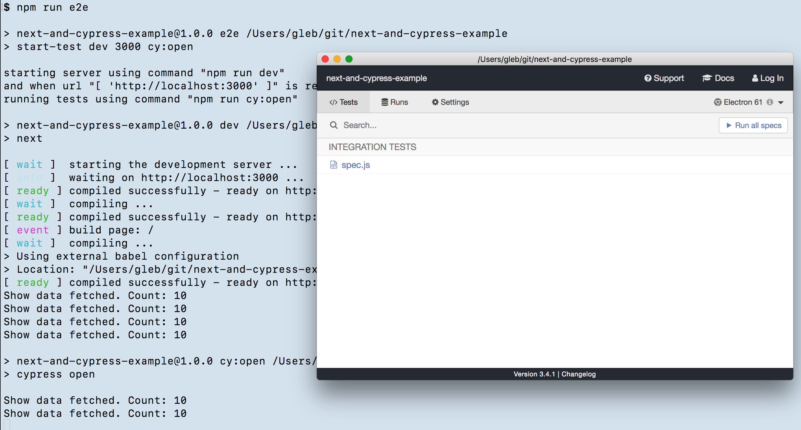
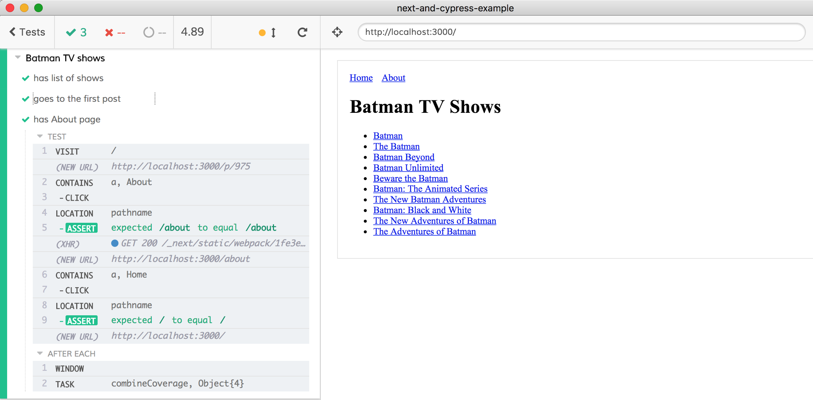
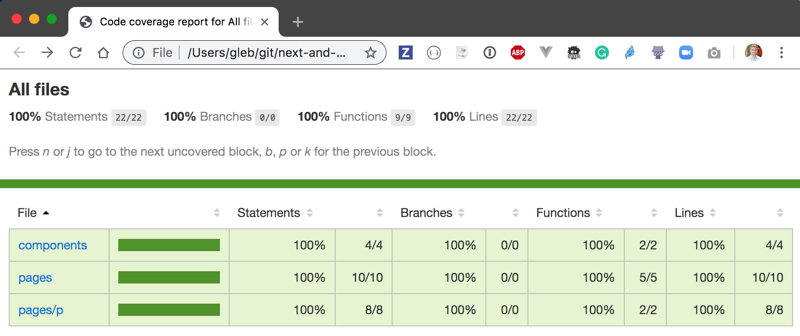

# next.js and Cypress example [![renovate-app badge][renovate-badge]][renovate-app]
> [Next.js](https://nextjs.org/) example instrumented for code coverage from [Cypress tests](https://www.cypress.io/)

## Install and run

```sh
npm install
npm run e2e
```

This starts the application at `localhost:3000` and opens Cypress test runner.



Click on the spec file to run the end-to-end tests.



## Coverage

The tests are instrumented following the instructions in [Cypress code coverage guide](https://on.cypress.io/code-coverage). In particular, the front-end is instrumented using [.babelrc](.babelrc) file like

```json
{
  "presets": ["next/babel"],
  "plugins": ["istanbul"]
}
```

When you run tests, the code coverage report is saved in `coverage` folder. There are reports in several formats, but open the HTML one for human-readable report.

```shell
$ open coverage/lcov-report/index.html
```




## See more

- [Cypress code coverage guide](https://on.cypress.io/code-coverage)

### Small print

Author: Gleb Bahmutov &lt;gleb.bahmutov@gmail.com&gt; &copy; 2019

* [@bahmutov](https://twitter.com/bahmutov)
* [glebbahmutov.com](https://glebbahmutov.com)
* [blog](https://glebbahmutov.com/blog)

License: MIT - do anything with the code, but don't blame me if it does not work.

Support: if you find any problems with this module, email / tweet /
[open issue](https://github.com/bahmutov/next-and-cypress-example/issues) on Github

## MIT License

Copyright (c) 2019 Gleb Bahmutov &lt;gleb.bahmutov@gmail.com&gt;

Permission is hereby granted, free of charge, to any person
obtaining a copy of this software and associated documentation
files (the "Software"), to deal in the Software without
restriction, including without limitation the rights to use,
copy, modify, merge, publish, distribute, sublicense, and/or sell
copies of the Software, and to permit persons to whom the
Software is furnished to do so, subject to the following
conditions:

The above copyright notice and this permission notice shall be
included in all copies or substantial portions of the Software.

THE SOFTWARE IS PROVIDED "AS IS", WITHOUT WARRANTY OF ANY KIND,
EXPRESS OR IMPLIED, INCLUDING BUT NOT LIMITED TO THE WARRANTIES
OF MERCHANTABILITY, FITNESS FOR A PARTICULAR PURPOSE AND
NONINFRINGEMENT. IN NO EVENT SHALL THE AUTHORS OR COPYRIGHT
HOLDERS BE LIABLE FOR ANY CLAIM, DAMAGES OR OTHER LIABILITY,
WHETHER IN AN ACTION OF CONTRACT, TORT OR OTHERWISE, ARISING
FROM, OUT OF OR IN CONNECTION WITH THE SOFTWARE OR THE USE OR
OTHER DEALINGS IN THE SOFTWARE.

[renovate-badge]: https://img.shields.io/badge/renovate-app-blue.svg
[renovate-app]: https://renovateapp.com/
